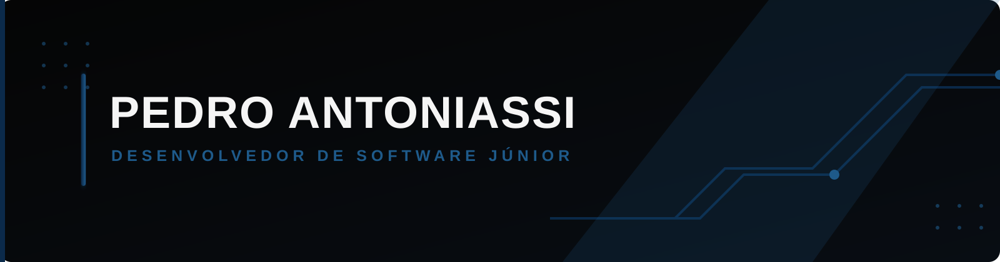

<picture>
  <source media="(prefers-color-scheme: dark)" srcset="./assets/header-dark.svg">
  <source media="(prefers-color-scheme: light)" srcset="./assets/header-light.svg">
  
</picture>

 

<a href="#sobre"><b>Sobre</b></a> &nbsp;·&nbsp;
<a href="#competências"><b>Competências</b></a> &nbsp;·&nbsp;
<a href="#stack"><b>Stack</b></a> &nbsp;·&nbsp;
<a href="#projetos"><b>Projetos</b></a> &nbsp;·&nbsp;
<a href="#contato"><b>Contato</b></a>

 

## Sobre

Olá! Eu sou **Pedro Antoniassi**, formado em **Análise e Desenvolvimento de Sistemas** pela UniCesumar e atualmente em busca da minha primeira oportunidade profissional como **Desenvolvedor de Software Júnior**.

Tenho interesse em desenvolvimento de software e venho construindo minha base técnica por meio de estudos e projetos práticos, principalmente utilizando **Java e Python**.

Busco constantemente aprimorar meus conhecimentos, desenvolver novas habilidades e transformar o conhecimento adquirido em soluções funcionais e bem estruturadas.

 

## Competências

<table> <tr>

<td width="25%" valign="top">

<h3>Processos</h3>

Conhecimento em processos fiscais 
Organização de processos 
Atenção aos detalhes

</td>

<td width="25%" valign="top">

<h3>Comunicação</h3>

Boa comunicação 
Bom relacionamento interpessoal 
Escuta ativa

</td>

<td width="25%" valign="top">

<h3>Comportamento</h3>

Proatividade 
Comprometimento 
Responsabilidade

</td>

<td width="25%" valign="top">

<h3>Aprendizado</h3>

Facilidade para aprender 
Adaptação a novos desafios 
Busca constante por conhecimento

</td>

</tr> </table>

 

## Stack

| Categoria       | Tecnologias                                  |
| :-------------- | :------------------------------------------- |
| *Linguagens*    | Java · Python                                |
| *Web*           | HTML · CSS                                   |
| *Versionamento* | Git · GitHub                                 |
| *Ferramentas*   | IntelliJ IDEA · PyCharm · NetBeans · Postman |

<b>Visualizar em ícones</b>

 

 

 

## Projetos

### 🅿️ Unicesumar Parking

Sistema de gerenciamento de estacionamento desenvolvido inteiramente em **Python** durante minha formação técnica.

A aplicação permite registrar a **entrada e saída de veículos**, realizar automaticamente o **cálculo da tarifa de estacionamento** e gerar um **relatório de fechamento diário**, reunindo as principais operações do estacionamento em uma única aplicação.

**Tecnologia:** Python

 

### 💳 Creditall Challenge

Projeto desenvolvido como parte de um desafio técnico, a partir de uma base de requisitos e funcionalidades que defini previamente para a aplicação.

Durante o desenvolvimento, utilizei **Inteligência Artificial como ferramenta de apoio à implementação**, direcionando a estrutura, funcionalidades e características que eu queria para o projeto e realizando ajustes ao longo do processo para chegar ao resultado esperado.

**Tecnologias:** Java · SQL

 

## Contato

  

Construindo conhecimento, desenvolvendo projetos e evoluindo continuamente como desenvolvedor.

